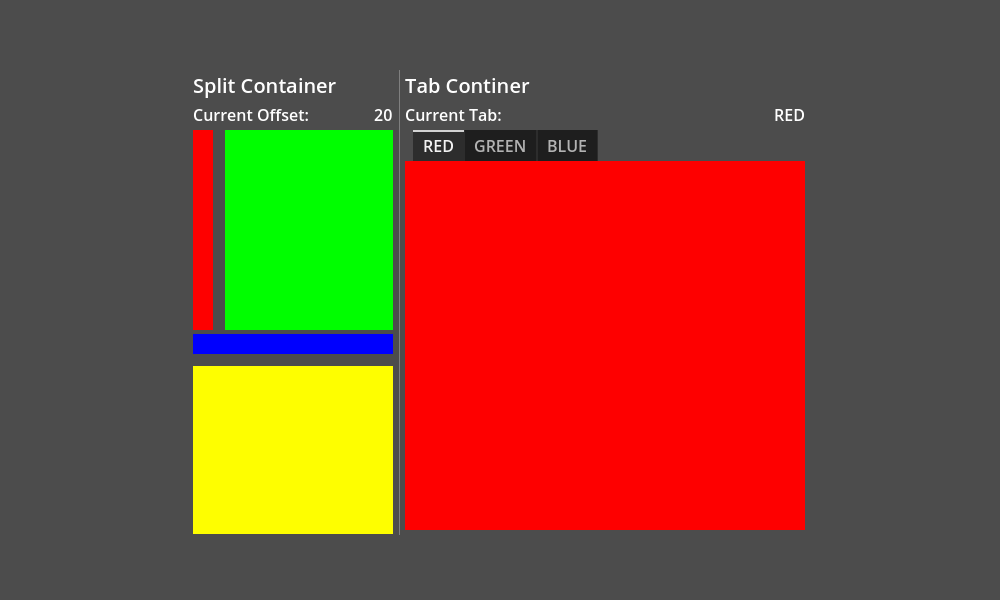
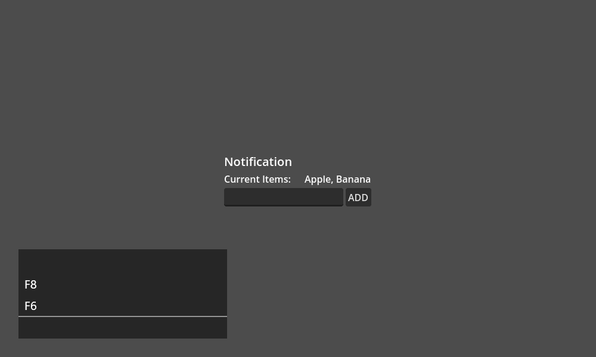
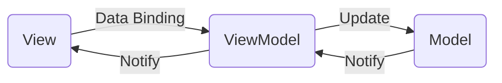

# GD Data Binding

GD Data Binding is a library that simplifies your UI coding by automatically syncing data between views and models.

## Demo

## Example

See the usage in [`examples`](examples).

## MVVM

GD Data Binding is based on the MVVM pattern.
In the pattern, the application UI and logic are separated into three components: View, ViewModel, and Model;

Reference: https://learn.microsoft.com/dotnet/architecture/maui/mvvm

For example, imagine to create a counter.
The view has a label to show the counted number and a button to count up the number.

The basic way to update the label content is that the button-pressed handler increases the count value and assigns it to the `text` of the label.

